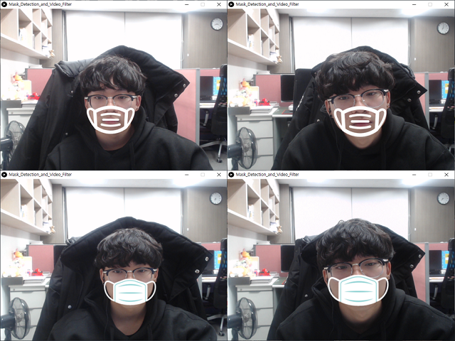

# 3D-Entertainment-Design
This repository is Project for "3D IMAGE DESIGN" lecture at Department of "Imaging Science and Arts"

Title 1 : Mask_Detection_and_Video_Filter.pde
* OpenCV for Java
* Mask Detection if you wear a mask
* Real-time Video Filter (Face Tracking)

  Mode 1 : Mask Detection   
  

<!--

 Mode 2 : Mask Video Filter 

  

-->

Title 2 : Youtube_Video_Player.pde
* Youtube Video Player similary
